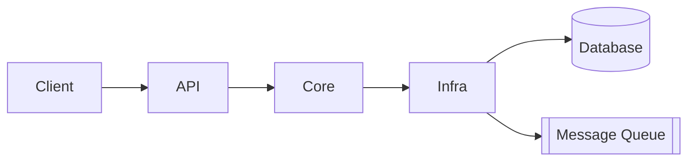

# How to Structure an `ARCHITECTURE.md` with Progressive Disclosure

A practical guide to writing an `ARCHITECTURE.md` that serves both human onboarding and AI-assisted development. The goal is a short, stable, navigable entry point that loads minimal context up front and links out to deeper documents on demand.

---

## 1. Guiding Principles

- **Keep it short.** Aim for under ~300 lines. If it grows, split content into linked docs.
- **Stable over current.** Document invariants and boundaries, not implementation details that churn weekly.
- **Bird's-eye first.** A new contributor (human or agent) should grasp the system in 2–3 minutes of reading.
- **Codemap, not code dump.** Name modules, files, and types and describe their *role*, never paste their contents.
- **Progressive disclosure.** The top-level file is a table of contents; depth lives behind links.
- **Revisit periodically.** Treat it as a quarterly artifact, not a per-PR one. Drift is acceptable on details, not on invariants.

---

## 2. Recommended Top-Level Structure

### 2.1 Problem Statement

One or two sentences explaining what the system *is for* — the user or business problem it solves, not its technical mechanics. This anchors every later decision.

### 2.2 High-Level Understanding

A Mermaid diagram (renders natively on GitHub) showing 5–9 major moving parts and how data flows between them. If you need more boxes, you're at the wrong altitude.



### 2.3 Codemap

The heart of the document. For each top-level folder/project, give:

- **What it is** (one line)
- **Entry point** (the file to open first)
- **Link** to a deeper doc if non-trivial

> - `src/Api/` — HTTP surface. Entry point: `Program.cs`. See [docs/api.md](./docs/api.md).
> - `src/Core/` — Domain logic, no I/O. Entry point: `DomainServices.cs`. See [docs/core.md](./docs/core.md).
> - `src/Infra/` — Persistence, messaging, external SDKs. See [docs/infra.md](./docs/infra.md).
> - `tests/` — xUnit tests mirroring the `src/` layout.

### 2.4 Invariants and Boundaries

State the rules that must hold regardless of who is editing the code. A reviewer (or an AI agent) should refuse to violate these.

- The `Core` layer has zero references to `Infra` or `Api`.
- All external I/O goes through interfaces defined in `Core/Abstractions/`.
- Public API DTOs live in `Api/Contracts/` and are versioned; breaking changes require a new version folder.

### 2.5 Cross-Cutting Concerns

One short paragraph per concern (logging, errors, auth, observability, config, feature flags), with a link to the deep doc.

> Observability is handled via OpenTelemetry traces and metrics, exported to Azure Monitor. See [docs/observability.md](./docs/observability.md).

### 2.6 Entry Points for Common Tasks

An "if you want to do X, start here" table — enormously useful for AI agents because it maps intents directly to file paths.

| Task | Start here |
|------|-----------|
| Add a new HTTP endpoint | `src/Api/Endpoints/` and [docs/api.md](./docs/api.md) |
| Add a domain rule | `src/Core/Services/` and [docs/core.md](./docs/core.md) |
| Wire up a new external service | `src/Infra/Clients/` and [docs/infra.md](./docs/infra.md) |
| Add a metric or trace | [docs/observability.md](./docs/observability.md) |

### 2.7 Glossary (Optional)

If the domain has jargon (e.g., *tenant*, *grain*, *aggregate*), define it once here and link from deeper docs.

---

## 3. The Progressive Disclosure Pattern

The top-level file is intentionally shallow. Depth lives in `/docs/` and is reached only when needed.

```
ARCHITECTURE.md          ← the map (this file)
docs/
  api.md                 ← endpoint catalog, auth, versioning
  core.md                ← domain model, aggregates, invariants
  infra.md               ← persistence, messaging, retries
  observability.md       ← traces, metrics, logs, dashboards
  testing.md             ← test strategy, fixtures, CI
  decisions/             ← ADRs, one file per decision
    0001-use-orleans.md
    0002-azure-service-bus.md
```

**Why this works for AI agents:** given a task like "add retry policy to the payment client," an agent reads `ARCHITECTURE.md`, follows the link to `docs/infra.md`, and loads only that file. It never needs to ingest the full codebase. Token usage stays bounded, and attention stays focused.

**Why it works for humans:** skimming 200 lines beats skimming 2,000.

---

## 4. Style Rules for Each Section

- **Use links liberally.** Any noun phrase that has its own doc should be a link.
- **No code blocks longer than ~10 lines.** Longer examples belong in deep docs.
- **Prefer present tense and active voice.** "The API validates inputs" beats "Inputs will have been validated by the API."
- **Avoid implementation verbs.** Don't say *how* (`uses a foreach loop to`); say *what* (`iterates the active tenants`).
- **Name real types and files.** `OrderProcessor` is more useful than "the order processing component."

---

## 5. Example Skeleton

A minimal, copy-pasteable starting point:

```markdown
# Architecture

## Problem
We process tenant-scoped order events at scale and expose a query API for dashboards.

## High-Level View
[mermaid diagram here]

## Codemap
- `src/Api/` — REST surface. Entry: `Program.cs`. See [docs/api.md](./docs/api.md).
- `src/Core/` — Domain logic, pure. Entry: `OrderService.cs`. See [docs/core.md](./docs/core.md).
- `src/Infra/` — Azure clients, persistence. See [docs/infra.md](./docs/infra.md).
- `src/Grains/` — Orleans grains for stateful processing. See [docs/grains.md](./docs/grains.md).

## Invariants
- `Core` has no references to `Infra` or `Api`.
- All Orleans grains are tenant-keyed; cross-tenant calls are forbidden.
- External I/O is mediated by interfaces in `Core/Abstractions/`.

## Cross-Cutting
- **Observability:** OpenTelemetry → Azure Monitor. See [docs/observability.md](./docs/observability.md).
- **Errors:** Domain errors are typed; infra errors are wrapped at the boundary. See [docs/errors.md](./docs/errors.md).
- **Testing:** xUnit + Testcontainers for integration. See [docs/testing.md](./docs/testing.md).

## Where to Start
| Task | Path |
|------|------|
| New endpoint | `src/Api/Endpoints/` |
| New domain rule | `src/Core/Services/` |
| New Azure client | `src/Infra/Clients/` |
| New grain | `src/Grains/` + [docs/grains.md](./docs/grains.md) |
```

---

## 6. Generation and Maintenance

- **Generate the first draft with an LLM.** Tools like `code2prompt` serialize a repo into a single Markdown prompt; pipe that to a model with explicit section instructions to produce a usable skeleton. Treat output as a draft — review every invariant claim before committing.
- **Pair with ADRs.** Architecture decisions belong in `docs/decisions/` as numbered ADRs. `ARCHITECTURE.md` describes the *current* state; ADRs describe *why* it got there.
- **Review on a cadence, not every PR.** A quarterly review catches drift without creating documentation overhead.
- **Lint the links.** A CI check that all relative links resolve prevents rot.

---

## 7. Quick Checklist

Before merging an `ARCHITECTURE.md`, verify:

- [ ] Under ~300 lines.
- [ ] Problem statement in 1–2 sentences.
- [ ] One high-level diagram with ≤ 9 boxes.
- [ ] Codemap names every top-level folder/project with an entry point.
- [ ] At least 3 invariants stated explicitly.
- [ ] Each cross-cutting concern has an owner doc linked.
- [ ] A "where to start" table for common tasks.
- [ ] All links resolve.

---

## Core Insight

`ARCHITECTURE.md` is a **routing layer**, not a content layer. Its job is to get a reader (human or agent) to the right deep doc in under three minutes. Every other rule — brevity, the codemap format, invariants — flows from that single purpose.
